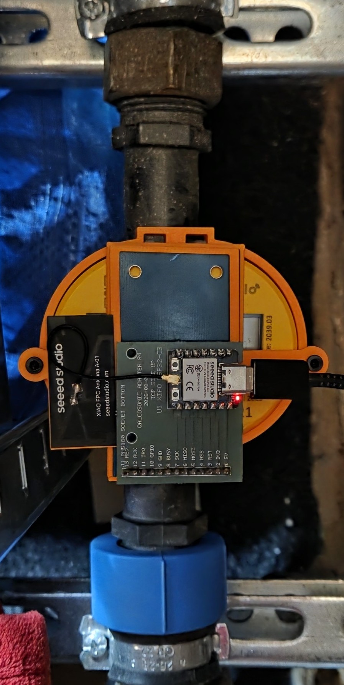
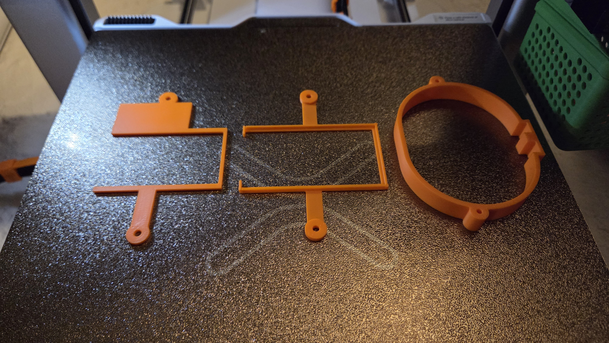

# Qalcosonic W1 NFC Reader

A compact ESPHome-based NFC reader for the **Qalcosonic W1** water meter, built around a **Seeed Studio XIAO ESP32-C3**, **PN5180** ISO15693 reader and a custom adapter PCB.

The reader exposes water consumption, flow, temperature, battery state and meter diagnostics to Home Assistant without a camera or OCR pipeline.



## What you need

- Qalcosonic W1 water meter
- PN5180 NFC reader module
- Standard 2.54 mm male pin header strip for the PN5180 ↔ adapter PCB connection (usually included with the PN5180 module)
- Seeed Studio XIAO ESP32-C3
- Custom PN5180 ↔ XIAO adapter PCB
- Three printed R1.0 mechanical parts
- 2 × M3 × 8 mm pan-head screws

The current R1.0 mechanical design has been physically test-printed, assembled and used on a real Qalcosonic W1.

## Quick start

1. Order or manufacture the adapter PCB from [`hardware/`](hardware/).
2. Print the mechanical parts from [`mechanical/`](mechanical/).
3. Assemble the XIAO ESP32-C3, adapter PCB and PN5180.
4. Flash [`firmware/qalcosonic-w1-nfc-reader.yaml`](firmware/qalcosonic-w1-nfc-reader.yaml) with ESPHome.
5. Install the reader on the meter using the supplied R1.0 orientation.
6. Add the ESPHome device to Home Assistant.

Detailed instructions are under [`docs/`](docs/).

## Firmware

The production configuration uses ESPHome **2026.8.2 or newer** and the external [`dbmaxpayne/esphome_qalcosonicnfc`](https://github.com/dbmaxpayne/esphome_qalcosonicnfc) component pinned to:

```text
bed6773b803a7ebf71613585aad8a73376d38b8e
```

The meter is polled every **5 minutes**. Primary water data and important error states are enabled by default; lower-level diagnostic data remains disabled by default.

See [`firmware/`](firmware/) for the configuration and secrets template.

## Mechanical design

The clean-sheet R1.0 mount consists of:

1. meter collar / base
2. PN5180 carrier
3. upper retainer

The PN5180 PCB is retained with two M3 × 8 mm screws. All three printed parts are designed to print without slicer-generated supports.



Ready-to-print and editable files are under [`mechanical/`](mechanical/).

The ready-to-download R1.0 model is also available on [Printables](https://www.printables.com/model/1829911-qalcosonic-w1-pn5180-nfc-reader-mount).

## PCB

The custom 2-layer adapter PCB connects the XIAO ESP32-C3 directly to the PN5180. Gerber/Excellon files and an AISLER-ready ZIP are under [`hardware/`](hardware/).

PCB photographs are illustrative. The checked-in Revision 3 manufacturing files are the fabrication source of truth.

## Printing

Recommended starting point:

- 0.4 mm nozzle
- 0.20 mm layer height
- 3 walls
- 20% grid or gyroid infill
- supports: **OFF**
- PETG recommended for long-term installation
- PLA suitable for fit and function testing

See [`mechanical/README.md`](mechanical/README.md) for part orientation and package contents.

## Documentation

- [`docs/assembly.md`](docs/assembly.md) — assembly
- [`docs/wiring.md`](docs/wiring.md) — signal mapping
- [`docs/esphome-installation.md`](docs/esphome-installation.md) — ESPHome setup
- [`docs/home-assistant.md`](docs/home-assistant.md) — Home Assistant integration
- [`docs/troubleshooting.md`](docs/troubleshooting.md) — common checks

## Repository layout

```text
firmware/      ESPHome configuration and example secrets
hardware/      PCB manufacturing files and documentation
mechanical/    3D design source and production package
docs/          Build and installation documentation
LICENSES/      License texts and scope
```

## Support this project

If this project helped you, you can support future development on [Buy Me a Coffee](https://buymeacoffee.com/kosla).

## Licensing

This repository uses scoped licenses:

- firmware/configuration: **MIT**
- PCB and mechanical design assets: **CERN-OHL-P-2.0**
- documentation and project photographs: **CC BY 4.0**

The external `dbmaxpayne/esphome_qalcosonicnfc` dependency remains under its upstream **LGPL-2.1** license.

See [`LICENSE`](LICENSE), [`LICENSES/README.md`](LICENSES/README.md) and [`ATTRIBUTION.md`](ATTRIBUTION.md).

## Disclaimer

This project is provided **as-is**, without warranty of any kind.

Use and installation are entirely at your own risk. The project author is not responsible for damage to equipment, property, water meters or electronics, loss of data, incorrect meter readings, or other consequences resulting from building, installing or using this project.

Always follow applicable local regulations and the requirements of your water utility or meter owner. Do not interfere with metrology seals, certified measurement functions or utility-owned equipment.

This is an independent community project and is not affiliated with or endorsed by Axioma Metering, Seeed Studio, NXP, ESPHome or any utility provider.
