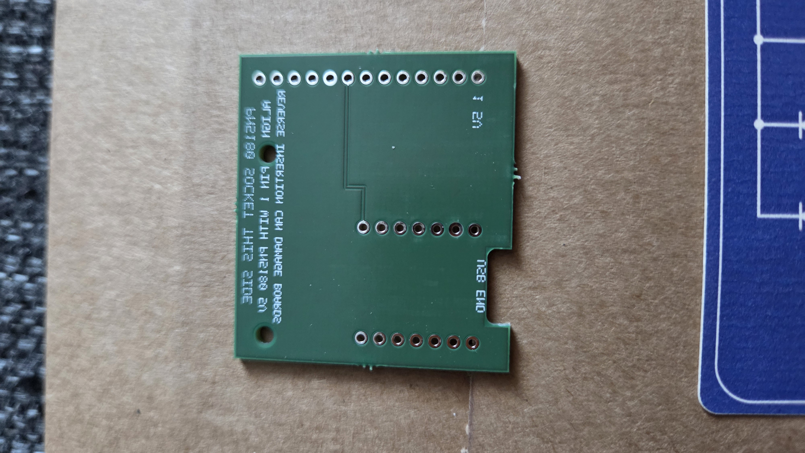
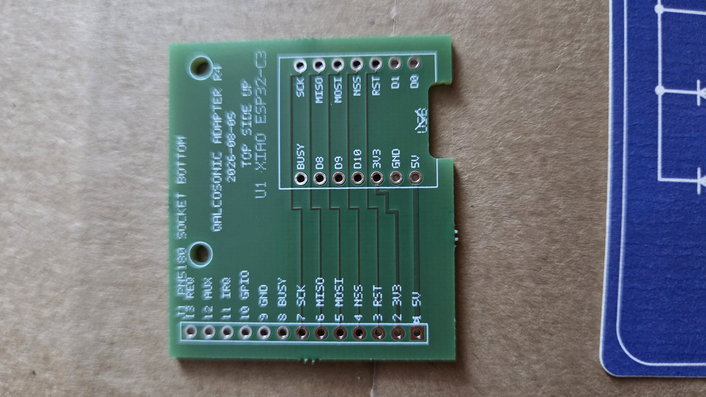
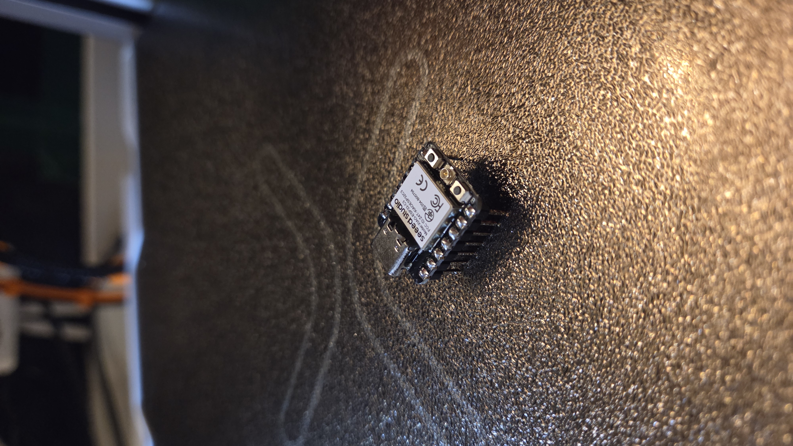
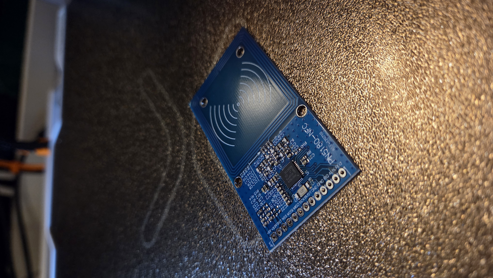

# Hardware

The reader uses a custom adapter PCB between the **PN5180** NFC module and a **Seeed Studio XIAO ESP32-C3**.

> PCB photographs are illustrative. Use the checked-in Revision 3 manufacturing files for fabrication.

## Core hardware

- Seeed Studio XIAO ESP32-C3
- PN5180 NFC reader module
- Standard 2.54 mm male pin header strip for the PN5180 ↔ adapter PCB connection
- Custom 2-layer adapter PCB
- 3D-printed R1.0 meter mount

The pin header is usually included with the PN5180 module. If your module is supplied without one, use a standard 2.54 mm male pin header strip cut to the required length.

| Adapter PCB back | XIAO ESP32-C3 | PN5180 |
|---|---|---|
|  |  |  |

## Pin mapping

| Signal | XIAO ESP32-C3 |
|---|---:|
| PN5180 MOSI | GPIO6 |
| PN5180 MISO | GPIO7 |
| PN5180 SCK | GPIO21 |
| PN5180 NSS | GPIO5 |
| PN5180 BUSY | GPIO20 |
| PN5180 RST | GPIO4 |

This pinout matches the production ESPHome configuration under `firmware/`.

## PCB production specification

- Layers: 2
- PCB thickness: 1.6 mm
- Copper: 35 µm
- Surface finish: lead-free HASL
- Solder mask: green
- Silkscreen: white
- Stencil: not required for the hand-assembled build

## Manufacturing files

- `hardware/gerbers/` — complete Gerber/Excellon fabrication set
- `hardware/manufacturing/qalcosonic-w1-nfc-reader-pcb-rev3-aisler.zip` — AISLER-ready archive

See [`manufacturing/README.md`](manufacturing/README.md) for the fabrication notes.

Always inspect the board-house preview before placing an order.

## Assembly notes

Before applying power:

1. Inspect solder joints for bridges.
2. Verify 3.3 V and GND are not shorted.
3. Confirm the XIAO and PN5180 orientation.
4. Check signal routing against the pin table above.
5. Power the board on the bench and check for abnormal heating before installing it on the meter.
